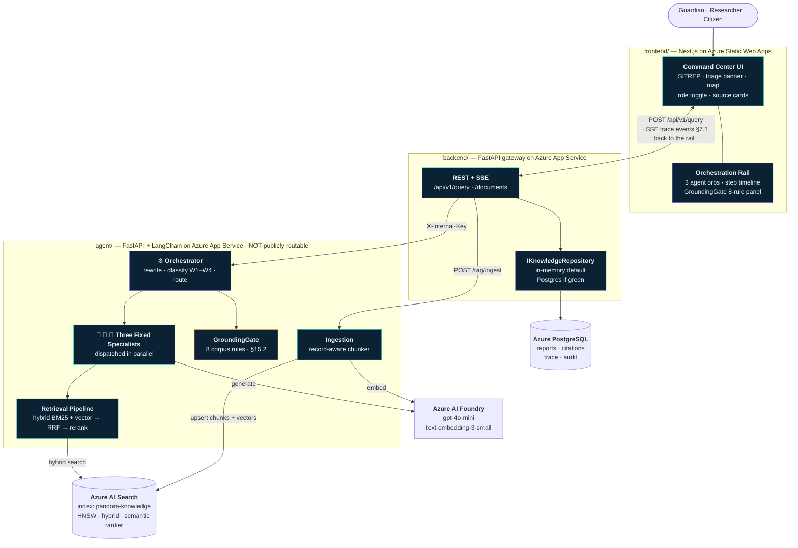
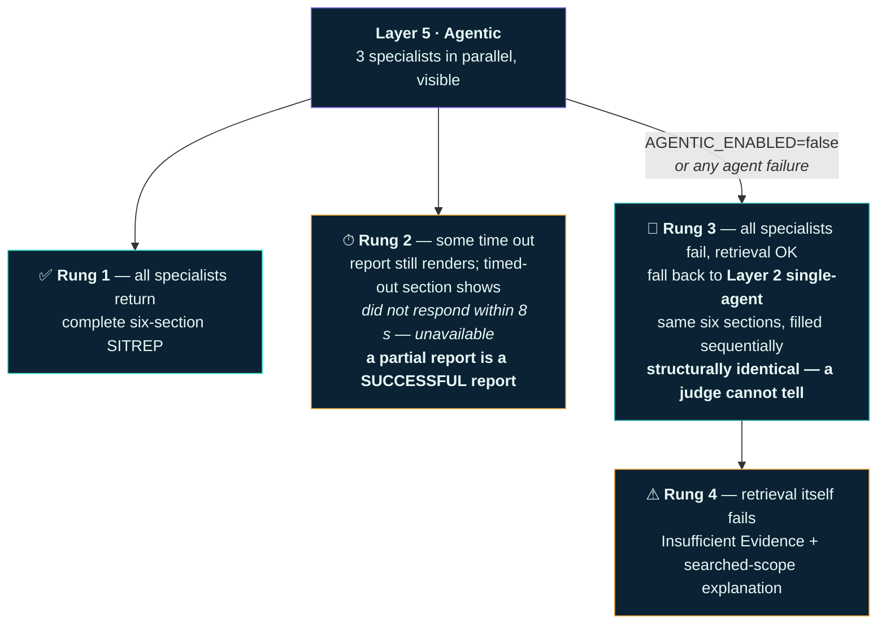
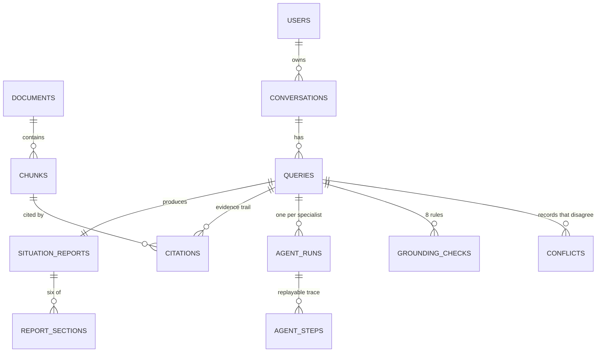

# Pandora Knowledge Guardian — Architecture Diagram

**Derived from `SOLUTION.md` (Revision 2).** Five views, each answering one question a judge or a
teammate will actually ask.

| # | View | Answers |
|---|---|---|
| 1 | [System Architecture](#1--system-architecture) | What are the pieces and who talks to whom? |
| 2 | [Ingestion Pipeline](#2--ingestion-pipeline-offline-run-once) | How does a 56-page PDF become a searchable index? |
| 3 | [Query Runtime](#3--query-runtime-the-main-diagram) | What happens between the question and the Situation Report? |
| 4 | [Degradation Ladder](#4--degradation-ladder--layer-isolation) | What happens when something fails? |
| 5 | [Data Model](#5--data-model-where-state-lives) | Where does state live? |

> **Stack note.** `SOLUTION.md` §10.2/§14 references .NET, EF Core, and Semantic Kernel, while
> `CLAUDE.md` and `docs/ARCHITECTURE.md` specify Python + FastAPI + LangChain across two services.
> These diagrams use the **Python/FastAPI** stack per `CLAUDE.md`. The conflict is in the prose of
> `SOLUTION.md`, not in the design — every component below is stack-agnostic. Worth resolving in the
> Decisions Log before first commit.

---

## 1 · System Architecture

**The one rule:** the browser only ever talks to the backend gateway. Never the agent service,
never Azure AI Search, never Foundry. One origin, one auth surface, one place keys live.

---

## 2 · Ingestion Pipeline (offline, run once)

The differentiator lives here. **Record-aware chunking, not fixed-size splitting** — §4.2.

```mermaid
flowchart LR
    SRC["Pandora_RAG_Knowledge_2026.pdf<br/>56 pages · ~130 records<br/><i>+ user uploads: PDF/TXT/CSV/DOCX</i>"]
    EX["Extract<br/>text + page + font-size<br/>font size → heading detection"]

    SRC --> EX --> ROUTE{"Boundary detector<br/>heading matches<br/>REG · STL · FAU · FLR · MED<br/>ACC · INC · POL · KC + number"}

    ROUTE -->|"record heading found"| T1["<b>Tier 1 · Record chunks</b><br/>1 record = 1 chunk · ~130<br/>900–1,400 chars<br/><b>zero overlap, by design</b>"]
    ROUTE -->|"prose sections"| T2["<b>Tier 2 · Narrative chunks</b><br/>split on deepest heading · ~90<br/>800 tokens / 120 overlap"]
    ROUTE -->|"tables 4.5 · 12.11 · 14.1 · 14.2"| T2B["<b>Tier 2b · Table-row chunks</b><br/>1 row = 1 chunk<br/>carries caption + headers"]

    T1 & T2 & T2B --> META["Attach metadata §4.2<br/>record_id · record_type · chapter · page<br/>region_id · evidence_quality · risk_level<br/>record_date · document_name · field_name"]
    META --> HDR["Prefix provenance header<br/><i>the ID travels into the model's context</i>"]
    HDR --> EMB["Embed<br/>text-embedding-3-small · 1536-d<br/>batched ×64 · backoff on 429"]
    EMB --> IDX[("Azure AI Search<br/><b>~220 high-precision chunks</b><br/>HNSW · cosine · m=4<br/>efConstruction 400 · efSearch 500")]

    IDX -.->|"T+1:15 GATE"| VER["Manual verification<br/>INC-005 · FAU-014 · WS-03 · FN-A<br/>POL-001 · KC-01 — clean, unmerged"]

    style T1 fill:#0A2233,stroke:#3EE8D0,color:#E8F6F5
    style T2 fill:#0A2233,stroke:#1FA9A0,color:#E8F6F5
    style T2B fill:#0A2233,stroke:#1FA9A0,color:#E8F6F5
    style VER fill:#0A2233,stroke:#F0A93E,color:#E8F6F5
    style IDX fill:#04121C,stroke:#7B6BF0,color:#E8F6F5
```

**Why it matters:** a 1000/200 fixed window slices `FAU-014 Blueveil Manta` mid-field and bleeds
`FAU-015` into the same chunk — the exact cross-record merge the corpus prohibits in §15.2 rule 3.
Record boundaries are the author's own, so there is nothing arbitrary to overlap across.

---

## 3 · Query Runtime (the main diagram)

One question → one **Situation Report**. Everything else is secondary.

```mermaid
flowchart LR
    Q(["<b>1 · Question</b><br/><i>the water near Awa Reef<br/>has turned turquoise and<br/>the fish are leaving</i>"])

    INSTANT["🔴 <b>Triage banner</b> · W3 EMERGENCY<br/>🗺️ <b>Map</b> · REG-01 ignites red<br/><i>both render in under 500 ms,<br/>before any generation starts</i>"]

    GG{"<b>6 · GroundingGate</b><br/>8 corpus rules, per section<br/>§15.2"}

    INS["⚠ <b>Insufficient Evidence —<br/>Recommend Field Investigation</b><br/><i>+ the brief's mandated sentence, verbatim</i><br/>what was searched · closest matches<br/>what evidence would resolve it"]

    REPORT["<b>7 · THE SITUATION REPORT</b><br/><i>six sections · fixed order · independent status</i><br/>─────────────<br/>1 · 🔴 Priority — W1–W4, cited ⚙️<br/>2 · Affected Species 🐋<br/>3 · Likely Causes + conflict panel 🌊<br/>4 · Recommended Actions 🚨<br/>5 · Sources — dedup union ⚙️<br/>6 · Confidence — states its reason ⚙️"]

    ROLE["<b>8 · Role toggle</b><br/>Guardian / Researcher / Citizen<br/><b>re-render only. never re-query.</b><br/><i>same evidence, same record IDs</i>"]

    TRACE["<b>Orchestration Rail</b> · SSE §7.1<br/>3 orbs ignite simultaneously<br/>threads tether each orb to its section<br/>8 rule rows tick green · replayable"]

    subgraph O["⚙️ 2–4 · ORCHESTRATOR · gpt-4o-mini · temp 0"]
      RW["<b>Rewrite and expand</b><br/>coreference · vocabulary<br/>2 variants · extract record IDs"]
      CL["<b>Classify</b><br/>use case · query shape<br/><b>severity W1–W4, cited to §4.5</b>"]
      RT{"<b>Route</b><br/>sitrep → all 3 parallel<br/>focused → 1<br/>compare → 2 disjoint"}
      RW --> CL --> RT
    end

    subgraph R["RETRIEVAL · run independently per specialist"]
      PF["metadata<br/>pre-filter"]
      BM["BM25 leg<br/>k=30"]
      VE["vector leg<br/>k=30"]
      RRF["RRF fusion<br/>~40 cands"]
      RR["semantic rerank<br/>score 0–4"]
      TK["top-6<br/><i>8 for compare</i>"]
      PF --> BM & VE --> RRF --> RR --> TK
    end

    subgraph S["<b>5 · PARALLEL SECTION ASSEMBLY</b> · 8 s timeout each · each owns one section"]
      A1["🐋 <b>Marine-Life Protector</b><br/>FAU-* FLR-* POL-*<br/>species isolation enforced<br/>↳ <b>Affected Species</b>"]
      A2["🌊 <b>Incident Investigator</b><br/>INC-* WS-* FN-* LAB-*<br/>owns conflict detection<br/>↳ <b>Likely Causes</b>"]
      A3["🚨 <b>Emergency Responder</b><br/>INC-* A.1–A.4 MED-* §12.11<br/>emits KC-01 comms template<br/>↳ <b>Recommended Actions</b>"]
    end

    Q --> RW
    CL -.-> INSTANT
    RT --> PF
    TK --> A1 & A2 & A3
    A1 & A2 & A3 --> GG
    GG -->|"pass"| REPORT
    GG -->|"fail · <b>1 retry only</b><br/>k widened to 10"| PF
    GG -->|"below 1.8 of 4.0,<br/>or retry exhausted"| INS
    INS --> REPORT
    REPORT --> ROLE
    RT -.-> TRACE
    A2 -.-> TRACE
    GG -.-> TRACE

    style O fill:#04121C,stroke:#7B6BF0,color:#E8F6F5
    style S fill:#04121C,stroke:#3EE8D0,color:#E8F6F5
    style REPORT fill:#0A2233,stroke:#3EE8D0,color:#E8F6F5
    style R fill:#04121C,stroke:#1FA9A0,color:#E8F6F5
    style Q fill:#0A2233,stroke:#8FAFB8,color:#E8F6F5
    style GG fill:#0A2233,stroke:#F0A93E,color:#E8F6F5
    style INS fill:#0A2233,stroke:#F0A93E,color:#E8F6F5
    style INSTANT fill:#0A2233,stroke:#F0644E,color:#E8F6F5
    style TRACE fill:#0A2233,stroke:#7B6BF0,color:#E8F6F5
    style ROLE fill:#0A2233,stroke:#7B6BF0,color:#E8F6F5
```

**Hard limits (§5.5):** 1 retry · 8 s per agent · 25 s total budget · 3 agents max · 8 LLM calls
max · no recursion — an agent cannot dispatch another agent.

**Parallelism:** 3 specialists @ ~3 s each cost **~3 s wall clock, not ~9 s**. Worst case, all
three timing out, is 8 s — not 24 s. The third agent is nearly free.

---

## 4 · Degradation Ladder & Layer Isolation

Every rung is a real report. There is no error screen.

**The ten feature flags** (§10.3) — wired the moment a layer *starts*, so a half-built layer is
always off by default. If anything is unstable at T+4:45 we flip the flag rather than debug.

| Flag | Layer | Off behaviour |
|---|---|---|
| `SITREP_SHELL` | 2 | Layer 1 prose answer with source cards |
| `TRIAGE_BANNER` | 3 | Report renders without the priority banner |
| `CONFIDENCE_METER` | 4 | Meter hidden; Layer 1 insufficient-evidence path still active |
| `GROUNDING_GATE_STRICT` | 4 | Score computed and shown, but never blocks an answer |
| `CONFLICT_DETECTION` | 4 | Standard grounded answer, no conflict panel |
| `AGENTIC_ENABLED` | 5 | **Layer 2 single-agent fill — identical report structure** |
| `MAP_VIEW` · `ROLE_TOGGLE` · `ORCH_ANIM` | 6 | Three independent flags; that element simply doesn't render |
| `DEMO_MODE` | — | Cached responses for the 4 demo questions — zero API dependency |

**The build order that makes this safe** — each layer is independently demoable, tagged, and
flagged. A later layer breaking can never take down an earlier one.

```mermaid
flowchart LR
    B1["<b>L1 · Core RAG</b><br/>T+2:00 · v1-core-rag<br/><b>banks 45 marks</b>"]
    B2["<b>L2 · SITREP shell</b><br/>T+2:40 · v2-sitrep<br/>Real-world 20 · UX 15"]
    B3["<b>L3 · Triage banner</b><br/>T+3:00<br/>Real-world 20"]
    B4["<b>L4 · Confidence + honesty</b><br/>T+3:20 · v3-honest<br/>Accuracy 20"]
    B5["<b>L5 · Parallel agents</b><br/>T+4:10 · v4-agentic<br/>Innovation 10 · UX 15"]
    B6["<b>L6 · Map · role toggle</b><br/>T+4:40 · if time<br/>UX 15 · Innovation 10"]
    B1 --> B2 --> B3 --> B4 --> B5 --> B6

    style B1 fill:#0A2233,stroke:#3EE8D0,color:#E8F6F5
    style B4 fill:#0A2233,stroke:#F0A93E,color:#E8F6F5
    style B5 fill:#0A2233,stroke:#7B6BF0,color:#E8F6F5
    style B6 fill:#0A2233,stroke:#8FAFB8,color:#E8F6F5
```

> **Layer 4 is the floor we would ship if the venue burned down.** All 45 core marks plus the
> honesty story, before a single line of agent code exists.

---

## 5 · Data Model (where state lives)

| Store | Holds | Authoritative for |
|---|---|---|
| **Azure AI Search** | ~220 chunks + 1536-d vectors + search metadata | Everything the AI **retrieves** |
| **PostgreSQL** | reports, sections, citations, trace, grounding audit, conflicts | Everything the system **did** |
| **In-memory repo** | the same, behind `IKnowledgeRepository` | **The demo default** — Postgres cannot take the app down |

**The trace is product, not logging.** `AgentSteps` + `GroundingChecks` + `Citations` power trace
replay (demo insurance), satisfy the submission's "evidence of retrieved sources" requirement, and
prove grounding is *audited* rather than asserted.

---

## The five wow features, located on the diagrams

| # | Feature | Diagram | Layer |
|---|---|---|---|
| 1 | Visible parallel agent assembly | 3 — `PARALLEL SECTION ASSEMBLY` + Orchestration Rail | 5 |
| 2 | Honesty flip | 3 — `Insufficient Evidence` branch off GroundingGate | 4 |
| 3 | Emergency triage (W1–W4, cited) | 3 — `Classify` → `Triage banner`, renders in <500 ms | 3 |
| 4 | Map-based incident view | 3 — `Map REG-01 ignites`, fed by `region_id` from diagram 2 | 6 |
| 5 | Role toggle | 3 — `Role toggle`, downstream of the report, **no path back to retrieval** | 6 |
