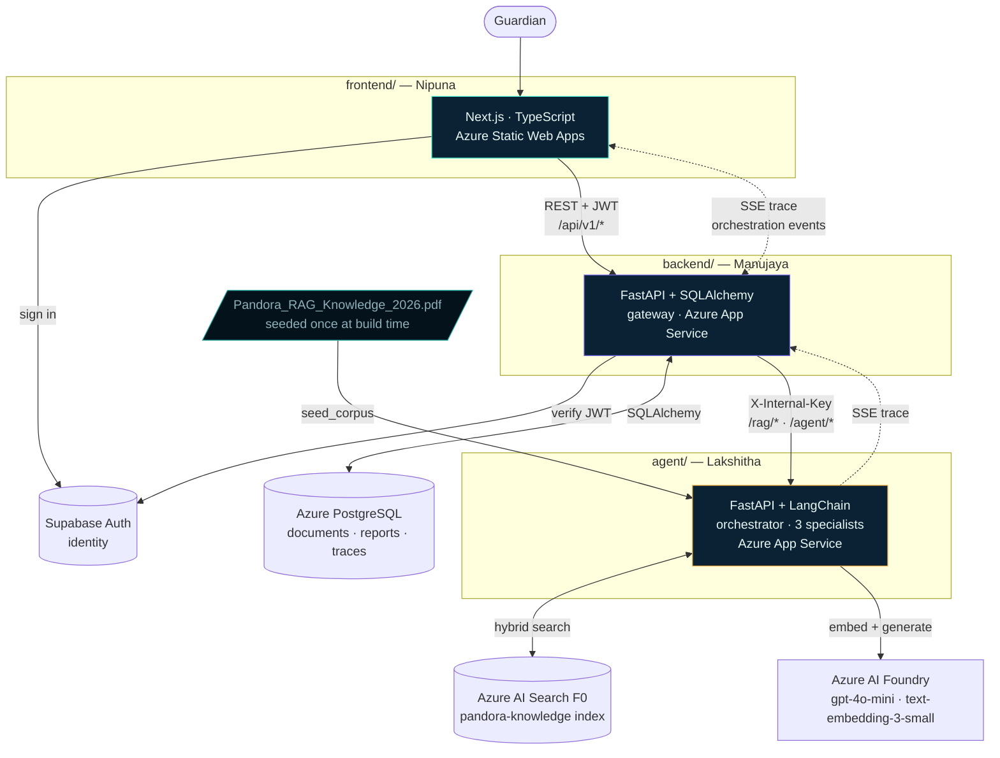

# ARCHITECTURE.md

**Pandora Knowledge Guardian** — how the four layers connect.

---

## The Shape

Four services, one per person, talking over HTTP.



**One rule: the browser only ever talks to the backend gateway.** Never to the agent service, never
to Azure AI Search, never to Foundry. One origin, one auth surface, one CORS config, one place
where keys live. The agent service isn't publicly routable at all.

**The dotted line matters.** The orchestration trace is Server-Sent Events, emitted by the agent
service and **proxied through the gateway** to the browser. The gateway does not buffer it — it
forwards events as they arrive, because the whole point is that a judge watches three sections fill
in real time. See [The SSE path](#the-sse-path) below.

---

## Who Owns What

| Layer | Folder | Owner | Responsibility |
|---|---|---|---|
| **Frontend** | `frontend/` | Nipuna | Seven routes (3 public, 4 authed), the Situation Report renderer, citation interaction, orchestration rail, map, role toggle. No business logic, no keys. |
| **Backend (gateway)** | `backend/` | Manujaya | Auth verification, document metadata, report + trace persistence, **SSE passthrough**, orchestration between frontend and agent. **Owns Postgres.** |
| **Agent service** | `agent/` | Lakshitha | Record-aware chunking, embedding, hybrid retrieval, LLM reranking, grounded generation, GroundingGate, conflict detection, the orchestrator and its three specialists. **Owns Azure AI Search.** Stateless. |
| **Infrastructure** | `infra/` | Malindu | Provisioning, secrets, corpus seeding, CI/CD, deployment, health checks. |

**Both backend services are Python + FastAPI.** They're still split because the split buys
independent deploys and clean ownership: Manujaya can redeploy the API without touching the
retrieval pipeline, and Lakshitha can rebuild the chains without risking auth or the database.

### Frontend routing and the auth boundary

| Route | Access | Screen |
|---|---|---|
| `/` | Public | Landing page |
| `/login` · `/signup` | Public | Supabase auth |
| `/app` | **Authed** | **Command Center ★** — question in, Situation Report out |
| `/app/documents` | **Authed** | Knowledge base — the preloaded corpus plus uploads |
| `/app/incidents` | **Authed** | Incident register — browsable `INC-*` records by risk and region |
| `/app/investigations` | **Authed** | Past Situation Reports *(if time)* |

**The auth boundary is `app/app/layout.tsx`** — one guard wrapping every authenticated route, plus
the shared app shell. Public routes sit outside it and never check a session. Unauthenticated
access to any `/app/*` route redirects to `/login`, preserving the intended destination.

> **A demo account is pre-seeded.** Nobody creates an account on stage. Auth is real, but it is
> never the thing being demonstrated, and it never gates Layer 1.

Full screen requirements: `docs/UI_SPEC.md`.

**The split that matters:** the backend owns *application state* (which documents exist, which
reports were produced, what the trace was). The agent service owns *AI state* (vectors, chains,
prompts) and holds no application database at all. It can be restarted, redeployed, or scaled
without touching user data.

---

## One Query, End to End

Following *"the water near Awa Reef has turned turquoise and the fish are leaving the area"*
through all four layers.

### 1 · Browser → Frontend
The guardian types the situation in plain language and hits Enter. React opens the SSE stream and
calls the ask endpoint with `{ question, conversation_id }` and
`Authorization: Bearer <supabase-jwt>`. The UI shows the report skeleton immediately — six labelled
section slots, all empty.

### 2 · Frontend → Backend
The gateway validates the Supabase JWT (signature + expiry) and extracts the user ID. Rejects with
`401 unauthenticated` if bad. Confirms the corpus index is reachable — otherwise
`422 corpus_not_indexed`, and no LLM call is wasted.

### 3 · Backend → Agent service
The gateway calls the agent's sitrep endpoint with `X-Internal-Key`, forwarding the question plus
the last conversation turn for coreference. **30-second timeout** — on expiry,
`504 agent_service_timeout` rather than a hung browser. The SSE stream from the agent is forwarded
to the browser unbuffered from this moment on.

### 4 · Agent: orchestrate
`gpt-4o-mini` at temperature `0`, one call, five outputs:
- **Query rewriting** — vocabulary expansion (*"looks weird and blue-green"* → *"water turns bright
  turquoise"*), last-turn coreference resolution, explicit record-ID extraction, 2 query variants
- **Classification** — use case · **W1–W4 severity against the corpus's own §4.5 scale** · query
  shape (`simple` / `compare` / `summarize`)
- **Filter hints** — `record_type`, `region_id`, `record_date`
- **Routing** — `sitrep` (all 3 specialists) / `focused` (1) / `compare` (2)

**Two events fire immediately, before any generation:** `priority.classified` and `map.zone_lit`.
The banner and the map zone render in under 500 ms. The screen is never blank and never spinning —
this is a deliberate perceived-latency decision, not a nicety.

Severity is **not** an invented label. A made-up *"priority: high"* is an ungrounded model opinion,
which is exactly what the rubric penalises. A `W3` classification traced to §4.5 **is itself a cited
claim**, and it carries the corpus's own prescribed response.

### 5 · Agent: embed the query
`text-embedding-3-small` on Azure AI Foundry → a 1536-dimension vector. Same model that indexed the
corpus; a mismatch here silently ruins retrieval with no error to tell you.

### 6 · Agent: hybrid retrieval
Two searches against Azure AI Search, `k = 30` per leg, then fused:
- **Vector** — cosine over `content_vector`. Catches *"why are the animals leaving?"* against
  `FAU-001`'s *"a sudden absence can reflect migration, disturbance, weather, sampling error, or
  mortality"* — no shared keywords at all.
- **Keyword (BM25)** — exact matches on record IDs (`INC-005`), station codes (`WS-03`), policy
  numbers, and invented proper nouns with no pretraining signal (*Tideglass Grazer*, *Ventplume
  Shrimp*, *Mistroot Basin*).

**Neither leg alone is sufficient. Hybrid is a correctness requirement here, not a bonus feature.**
An embedding model has never seen "Ribbonfin Skimmer" and will place it near generic fish
vocabulary; BM25 matches it exactly, instantly.

RRF fusion across both legs and both query variants → ~40 deduplicated candidates.

> **F0 constraint — designed around, not worked around.** The free tier has **no semantic
> reranker**; that's Basic+. So the rerank stage is a **batched `gpt-4o-mini` call that scores all
> candidates 0–10 in one request** (~600 ms). This is the primary path, not a fallback. Scores
> normalize to a `0–1` `relevance_score` for display. **Do not architect around the built-in
> ranker — it isn't there.**

Top **6** chunks go forward (top **8** for comparison queries, so neither subject is starved).
Below a top rerank score of **4.5 / 10**, retrieval is judged insufficient and step 9's honesty path
takes over.

### 7 · Agent: parallel section assembly
Three specialists are dispatched **concurrently**, each owning one Situation Report section:

| Specialist | Owns | Retrieval focus |
|---|---|---|
| 🐋 **Marine-Life Protector** | Affected Species | `FAU-*`, `FLR-*`, `POL-*` — each species isolated to its own record |
| 🌊 **Incident Investigator** | Likely Causes + conflicts | `INC-*` plausible causes, `WS-*` readings, `FN-*` / `LAB-*` notes |
| 🚨 **Emergency Responder** | Recommended Actions | `INC-*` immediate actions, `A.1–A.4` checklists, `MED-*`, `12.11` command roles |

The orchestrator itself owns **Priority**, **Sources**, and **Confidence**.

**Section ownership beats answer-merging.** Merging three full answers needs a synthesis pass that
can itself hallucinate, and produces one undifferentiated block where the parallelism is invisible.
Each agent writing into its own labelled slot means a judge *sees* three agents working without
being told — and it removes the merge step entirely, cutting one LLM call and one hallucination
surface.

Every prompt enforces the same contract: **closed-book** (only the provided context — real Earth
marine biology is a hallucination here even when true), **a citation marker per claim**,
**documented protocol separated from model inference**, **hypotheses stay hypotheses**, **no
cross-record merging**, **time and place preserved**, and **abstain over guess**.

Wall-clock cost is the *slowest* agent, not the sum: ~3 s for three specialists, not ~9 s.

### 8 · Agent: GroundingGate
Before display, each section is decomposed into claim-level sentences and validated against
**eight checks mapped one-to-one to the corpus's own §15.2 Retrieval Grounding Rules.** This is not
our notion of "grounded" — it is the graders' published checklist, executed:

1. Every factual sentence carries ≥1 marker resolving to a retrieved chunk
2. Multiple documented causes are presented as hypotheses, never asserted as one
3. No cross-attribution between similar records
4. Dated/located claims keep their qualifier
5. Any `MED-*` citation forces red flags + the fictional-material disclaimer
6. Below-threshold retrieval forces the insufficient-evidence path
7. Conflicting records trigger the conflict panel
8. Uncited normative statements live inside a labelled *Model inference* block

Outputs: `groundedness` (supported claims ÷ total factual claims), a per-sentence verdict driving
inline highlighting, and a `confidence` level **that always states its reason**.

**Retry cap is 1, hard.** On failure the query is re-expanded and `k` widened to 10, then
regenerated once. If it fails again, surviving supported claims are shown with unsupported ones
visibly struck through — or the insufficient-evidence response. **We never loop.**

### 9 · Agent: honesty and conflict
Triggered **deterministically, not at model discretion** — model self-assessment of uncertainty is
unreliable, a rule is not. Any of: top rerank `< 4.5 / 10` · groundedness `= 0` · retry exhausted ·
sub-agent timeout with no partial result.

Conflict detection runs on structural signals first (any `disputed report` label in the set, ≥2
`field_note` records on one event, ≥2 `SV-*` records for the same species+region with differing
counts), with a semantic LLM check as confirmation only.

### 10 · Backend: enrich and persist
The gateway joins `document_name` onto each citation from Postgres (the agent returns `document_id`
only — it stays free of app-DB coupling). Persists the report, its sections, its citations, the
grounding checks, and the trace. Assembles the response shape in `docs/API_CONTRACT.md` §1.1.

### 11 · Frontend: render progressively
Each section renders **the moment it passes validation** — out of order, which is the proof they
were genuinely concurrent. Citation markers become interactive chips; activating one spotlights its
source card with record ID, chapter, page, verbatim excerpt, relevance score, and evidence-quality
badge. The conflict panel shows contested positions side by side. The confidence meter states its
reason in words.

### 12 · User flips the role toggle
Guardian → Citizen → Researcher, re-rendering **client-side from the frozen evidence set**. No
network call, no re-retrieval, no changed citations. One retrieval, one grounded claim set, three
presentations.

**This is a correctness requirement, not an optimization.** If the toggle re-ran the pipeline, a
judge would watch cited evidence shift between roles and the grounding story would visibly collapse.

---

## The SSE Path

The orchestration trace is the product's innovation surface — agentic architecture that can't be
perceived earns nothing. It crosses all three services, so the event schema is **frozen in the first
30 minutes** and only ever extended.

```
agent/    emits an event per orchestration step (sse-starlette)
   ↓      priority.classified · map.zone_lit · route.decided · retrieval.completed
   ↓      section.filling · section.completed · section.unavailable · conflict.detected
   ↓      validation.result · answer.completed
backend/  forwards each event unbuffered, adds nothing, blocks nothing
   ↓      (also tees events into agent_steps for replay)
frontend/ EventSource → updates the orchestration rail and fills report sections live
```

**Three rules:**
1. **New event types are additive only.** Never remove or rename one — three people build against
   this schema simultaneously. An unknown event type must be ignored by the client, not crash it.
2. **The gateway must not buffer.** Buffering defeats the entire purpose. No response aggregation,
   no waiting for completion.
3. **Handled failures are shown, not hidden.** *"⏱ Marine-Life Protector timed out at 8 s —
   continuing with partial result"* builds more credibility with judges than silence, because it
   proves the timeout logic is real.

Full event table: `docs/API_CONTRACT.md` §1.2, mirroring `SOLUTION.md` §7.1.

---

## Ingestion Flow

Two paths into the same index.

### Path A — the corpus, seeded once at build time *(the critical one)*

```
Pandora_RAG_Knowledge_2026 (1).pdf
  → extract text with page numbers + font sizes retained  (font size drives heading detection)
  → TWO-TIER RECORD-AWARE CHUNKING  (see below)
  → embed each chunk (text-embedding-3-small, batched at 64, backoff on 429)
  → upsert into Azure AI Search with the full 14-field metadata schema
  → commit the prebuilt index; app is queryable the second it loads
```

**Why pre-indexed:** the demo cannot fail on an upload, judges see value instantly, and it lets us
hand-verify the extraction of all ~130 records rather than trusting a generic parser under time
pressure. Re-indexing the whole corpus must stay under ~60 seconds so chunking can be iterated on.

### Path B — user uploads *(demoed, never on the critical path)*

```
Upload (multipart)
  → Gateway: validate type + size, write documents row (status=pending), return 202 immediately
  → Gateway → Agent: POST /rag/ingest (60s timeout, base64 payload)
      → same extract → chunk → embed → index pipeline, appended with a new document_id
  → Gateway: update documents row → status=indexed, chunk_count, record_count, page_count
  → Frontend: polls until status leaves pending/indexing
```

**Async by design.** Upload returns `202` in under a second; the browser never waits on embedding.
Because uploads share the index with a `document_id`, cross-document questions work naturally.

### The chunking decision — our highest-leverage retrieval choice

**Do not use fixed-size character splitting.** The corpus is not prose. It is ~130 atomic records
with stable IDs and fixed internal field schemas — every `INC-*` record has exactly six fields,
every `FAU-*` record exactly five.

A 1000-character window with 200-character overlap slices `FAU-014 Blueveil Manta` through the
middle of its *Known pressures* field and bleeds the tail of `FAU-015 Currentback Turtle` into the
same chunk. The model then confidently attributes the manta's pressures to the turtle — and that
failure is **named as a violation by the corpus itself** in §15.2:

> *"Do not merge details from two species, villages, plants, or incidents merely because their names
> or habitats are similar."*

Fixed-size chunking doesn't retrieve slightly worse here. It **structurally guarantees the exact
error the graders are checking for.**

| Tier | What | Sizing | Overlap |
|---|---|---|---|
| **1 · Record chunks** *(primary, ~130)* | One complete corpus record = one chunk. Boundary detection on `^(REG\|STL\|FAU\|FLR\|MED\|ACC\|INC\|POL\|KC)-\d+`. **Never split a record; never merge two.** | 900–1,400 chars | **None, by design** |
| **2 · Narrative chunks** *(~90)* | Genuine prose (chapters 1, 4, 8, 10, 11) and appendix checklists. Split on the deepest heading first, then pack. | 800 tokens | 120 tokens |
| **2b · Table chunks** | Corpus tables (**corpus** §4.5 W1–W4, §12.11 command roles, §13, §14.1, §14.2) linearized **one row per chunk**, each carrying the caption and column headers. | one row | — |

**Zero overlap in Tier 1 is deliberate.** Overlap exists to prevent semantic bleed across arbitrary
cut points. There are no arbitrary cut points here — the boundaries are the author's own. Adding
overlap would reintroduce exactly the cross-record contamination we are eliminating.

Each chunk is prefixed at index time with a compact **provenance header** (record ID, name, chapter,
region) so the ID travels with the text into the model's context. The model cannot cite an ID it
cannot see.

**Result: ~220 high-precision chunks**, each semantically complete and independently citable —
versus ~450 arbitrary fragments from naive splitting.

`WS-03` must be independently retrievable, because it is the measurement that corroborates
`INC-005`. Bundling the whole table into one chunk buries it.

---

## Where State Lives

| Store | Holds | Owner | Source of truth for |
|---|---|---|---|
| **Azure AI Search** | Chunk text + 1536-d vectors + the 14-field metadata schema | Agent service | Everything the AI retrieves |
| **Azure PostgreSQL** | `documents`, `chunks`, `conversations`, `queries`, `situation_reports`, `report_sections`, `citations`, `agent_runs`, `agent_steps`, `grounding_checks`, `conflicts`, `users` | Backend | Everything that happened |
| **Supabase** | Users, sessions, JWTs | Supabase | Identity |
| **Agent service** | *Nothing* — stateless | — | — |

All tables and columns are `snake_case`, plural tables — per `CLAUDE.md`. Full column-level schema:
`SOLUTION.md` §9.1.

**Search is authoritative for retrieval; Postgres stores the chunk reference and metadata for
traceability.** Chunk *content* is not duplicated as a source of truth.

**Why `report_sections` is a table and not JSON on the report.** Independent status per section is
the whole point of the Situation Report contract — a section must be able to time out without
touching its siblings, and the trace must be able to stream `section.completed` events
individually. Rows make partial reports a first-class queryable state instead of a parsing exercise.

**Why the trace is persisted.** `agent_steps`, `grounding_checks`, and `citations` are not logging —
they are **product**. They power trace replay (demo insurance), they *are* the "evidence of retrieved
sources for each answer" the submission explicitly requires, and they let us prove grounding is
audited rather than asserted.

**Deletion crosses two stores.** Deleting a document must remove the Postgres row *and* the vectors
in Azure AI Search. Orphaned vectors mean the assistant cites documents the user deleted — a visible,
embarrassing bug. The gateway calls both. **The preloaded corpus is not deletable.**

---

## Layers, Flags, and Degradation

The architecture is built in six layers (`SOLUTION.md` §10), each independently demoable, each
behind a flag wired **before** the layer is built so a half-finished layer defaults off.

| Layer | Adds to the architecture | Flag |
|---|---|---|
| **1** | The whole spine above: ingest → chunk → embed → index → hybrid retrieve → rerank → grounded generate → sources → insufficient-evidence path | *(always on)* |
| **2** | Same single agent, output formatted into the six report sections instead of prose | `SITREP_SHELL` |
| **3** | W1–W4 triage banner with a cited reason | `TRIAGE_BANNER` |
| **4** | GroundingGate strictness, confidence meter, honesty flip, conflict detection | `CONFIDENCE_METER`, `GROUNDING_GATE_STRICT`, `CONFLICT_DETECTION` |
| **5** | Orchestrator + 3 parallel specialists with section ownership | `AGENTIC_ENABLED` |
| **6** | Map view · role toggle · orchestration animation — three *independent* flags | `MAP_VIEW`, `ROLE_TOGGLE`, `ORCH_ANIM` |
| — | Cached responses for the demo questions, zero API dependency | `DEMO_MODE` |

**Enforcement rule: no layer may modify code owned by an earlier layer.** Layer 5 adds an
orchestrator that *calls* Layer 1's retriever and generator; it never edits them. This is what keeps
the 45-mark core safe.

### The degradation ladder — every rung is a real report, never a crash

1. **All specialists return** → complete six-section report.
2. **Some return, some time out** → **the report still renders.** Completed sections are fully
   populated; a timed-out section shows its honest empty state with a reason: *"🐋 Marine-Life
   Protector did not respond within 8 s — Affected Species unavailable for this report."* A partial
   report is a **successful** report.
3. **All specialists fail, retrieval succeeded** → fall back to **Layer 2 single-agent generation**
   over the already-retrieved chunks, filling the same six sections sequentially. **Structurally
   identical output — a judge cannot tell.** Still fully grounded and cited.
4. **Retrieval itself fails** → the honesty flip, with the searched-scope explanation.

**Rung 3 is what makes the agentic layer safe to demo.** The agent layer sits *on top of* a working
single-agent RAG that produces the identical report format. Any agentic failure degrades to that,
not to an error screen. **The fallback is a live runtime path, not a separate plan.**

---

## Stack per Layer

| Layer | Technology | Deployed to |
|---|---|---|
| Frontend | Next.js (App Router), TypeScript, React | Azure Static Web Apps |
| Backend | Python 3.11+, FastAPI, SQLAlchemy 2.0, Alembic, psycopg, httpx, python-jose | Azure App Service |
| Agent | Python 3.11+, FastAPI, LangChain, pypdf, python-docx, sse-starlette, Uvicorn | Azure App Service |
| Vector store | Azure AI Search **F0** — API keys, no managed identity, **no semantic reranker** | managed |
| App database | Azure Database for PostgreSQL Flexible Server | managed |
| Models | Azure AI Foundry — `gpt-4o-mini`, `text-embedding-3-small` | managed |
| Auth | Supabase Auth | managed (only non-Azure piece) |
| CI/CD | GitHub Actions | GitHub |

---

## Why This Shape

**Why two Python services instead of one?** Both are FastAPI, so we *could* merge them. We don't,
because the split buys independent deploys and unambiguous ownership: Manujaya redeploys the API
without touching retrieval, Lakshitha rebuilds the chains without risking auth or the database.
Four folders, four owners, no shared files to conflict on.

**Why does the backend proxy instead of the frontend calling both?** One auth surface, one CORS
config, one place secrets live. Two public services would mean duplicating JWT validation and
exposing the agent service — which needs no public route at all.

**Why is the agent service stateless?** It can be restarted, redeployed, or scaled without touching
user data. It also means Lakshitha can rebuild the whole pipeline mid-hackathon without a migration.

**Why Azure AI Search over Chroma or FAISS?** Native hybrid search as managed configuration rather
than build time. On F0 we lose the semantic reranker and pay for it with one `gpt-4o-mini` call —
still a better trade than hand-building BM25 fusion inside a 5-hour window.

**Why one Azure OpenAI client for both generation and embeddings?** `gpt-4o-mini` and
`text-embedding-3-small` share a client, an endpoint, and a key — one integration, one credential,
one thing to debug.

**Why is the whole system snake_case?** Python, Pydantic, SQLAlchemy, Postgres, and our JSON
contract all use it natively. One convention, zero configuration, and no translation layer anywhere
between the database and the browser. **Corpus record IDs are the one exception** — `INC-005` and
`FAU-014` are quoted verbatim from the source and never re-cased, because they are citation anchors.

---

## Failure Modes

| Failure | Behaviour |
|---|---|
| A specialist times out (8 s) | Its section renders its honest empty state with the reason; **the report still ships**. Trace shows the timeout. |
| All specialists fail | Degradation rung 3 — Layer 2 single-agent fill, identical report structure |
| Total orchestration exceeds 25 s | Orchestrator returns best-available regardless of agent state |
| GroundingGate fails a section | One retry with widened `k`; then surviving claims shown with unsupported ones struck through, or the insufficient-evidence response. **Never loops.** |
| Retrieval below threshold | `has_sufficient_evidence: false` → *"⚠ Insufficient Evidence — Recommend Field Investigation"* + the brief's mandated sentence + what was searched + what would resolve it. **Never fabricate.** |
| Records conflict | Conflict panel, no cause declared, confidence drops to Moderate with the conflict named. This is a **feature**, not a failure. |
| Agent service down | Gateway `/health` check → `502 agent_service_unavailable`; documents and past reports still browsable |
| Agent service slow | 30 s timeout → `504 agent_service_timeout`; no hung request |
| Corpus index unreachable | `422 corpus_not_indexed` before any LLM call — no wasted tokens. Agent `/health` reports `search_index_reachable: false`. |
| Azure AI Search unreachable entirely | Fallback: in-memory cosine search over ~220 vectors behind the same retriever protocol — trivially fast at this scale. Costs hybrid + rerank; keeps the app alive. |
| Semantic/LLM rerank unavailable | Fall through to raw RRF fusion order. Retrieval quality drops; nothing breaks. |
| Ingestion fails | `documents.status = 'failed'` + `error_message`; other documents unaffected. Chunker falls back to narrative mode if record-ID detection finds fewer than 50 records. |
| Postgres down | Repository protocol's in-memory implementation serves the demo; nothing silently lost |
| SSE connection drops | Client falls back to the non-streaming response; the report arrives complete instead of progressively |

**The one that matters for the demo:** retrieval finding nothing must produce an **honest refusal**,
not a confident invention. A fabricated emergency protocol gets someone hurt — and per the corpus's
own §15.2 rule 6, stating absence is a requirement, not a courtesy.
