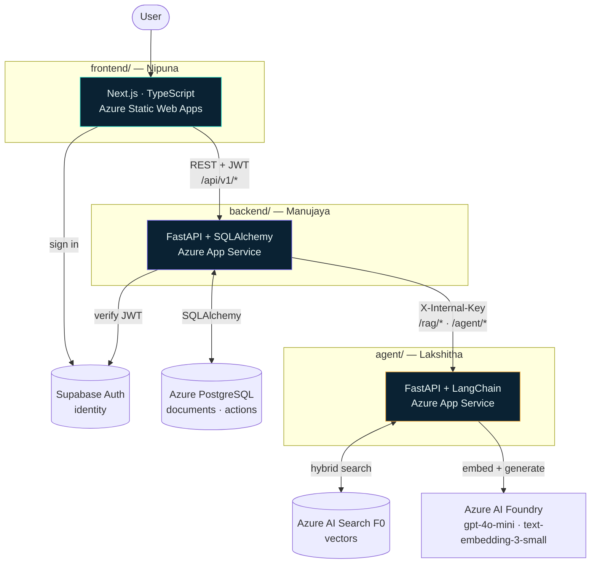

# ARCHITECTURE.md

**SME Business Intelligence Assistant** — how the four layers connect.

---

## The Shape

Four services, one per person, talking over HTTP.



**One rule: the browser only ever talks to the backend gateway.** Never to the agent service, never
to Azure AI Search, never to Foundry. One origin, one auth surface, one CORS config, one place
where keys live. The agent service isn't publicly routable at all.

---

## Who Owns What

| Layer | Folder | Owner | Responsibility |
|---|---|---|---|
| **Frontend** | `frontend/` | Nipuna | Seven routes (3 public, 4 authed), rendering, upload UX, citation interaction, action approval UI. No business logic, no keys. |
| **Backend (gateway)** | `backend/` | Manujaya | Auth verification, document metadata, action persistence, orchestration between frontend and agent. **Owns Postgres.** |
| **Agent service** | `agent/` | Lakshitha | Chunking, embedding, retrieval, grounded generation, action proposal. **Owns Azure AI Search.** Stateless. |
| **Infrastructure** | `infra/` | Malindu | Provisioning, secrets, CI/CD, deployment, health checks. |

**Both backend services are Python + FastAPI.** They're still split because the split buys
independent deploys and clean ownership: Manujaya can redeploy the API without touching the
retrieval pipeline, and Lakshitha can rebuild the chains without risking auth or the database.

### Frontend routing and the auth boundary

| Route | Access | Screen |
|---|---|---|
| `/` | Public | Landing page |
| `/login` · `/signup` | Public | Supabase auth |
| `/app` | **Authed** | Ask workspace ★ |
| `/app/documents` | **Authed** | Document library |
| `/app/actions` | **Authed** | Agent action inbox |
| `/app/history` | **Authed** | Past answers *(if time)* |

**The auth boundary is `app/app/layout.tsx`** — one guard wrapping every authenticated route, plus
the shared app shell. Public routes sit outside it and never check a session. Unauthenticated
access to any `/app/*` route redirects to `/login`, preserving the intended destination.

Full screen requirements: `docs/UI_SPEC.md`.

**The split that matters:** the backend owns *application state* (who uploaded what, which actions
are pending). The agent service owns *AI state* (vectors, chains, prompts) and holds no application
database at all. It can be restarted, redeployed, or scaled without touching user data.

---

## One Query, End to End

Following *"Which invoices are overdue and who do I need to chase?"* through all four layers.

### 1 · Browser → Frontend
User types the question and hits Enter. React calls `POST /api/v1/ask` with
`{ question, conversation_id }` and `Authorization: Bearer <supabase-jwt>`.
UI enters a loading state immediately.

### 2 · Frontend → Backend
The backend receives it. Validates the Supabase JWT (signature + expiry) and extracts the user ID.
Rejects with `401 unauthenticated` if bad. Checks the user has at least one document with
`status = 'indexed'` — otherwise `422 no_documents_indexed`, and no LLM call is wasted.

### 3 · Backend → Agent service
The backend calls `POST /rag/query` with `X-Internal-Key`, forwarding the question plus the last
conversation turn for coreference. **30-second timeout** — on expiry, `504 agent_service_timeout`
rather than a hung browser.

### 4 · Agent: embed the query
LangChain sends the question to `text-embedding-3-small` on Azure AI Foundry → a 1536-dimension
vector. Same model that indexed the documents; a mismatch here silently ruins retrieval.

### 5 · Agent: hybrid retrieval
Two searches against Azure AI Search, fused:
- **Vector** — cosine similarity over `content_vector`, catches *"overdue"* ≈ *"past due"* ≈ *"unpaid"*
- **Keyword (BM25)** — exact matches on invoice numbers, supplier names, amounts

Neither alone is sufficient: embeddings are weak on `INV-4471`, keywords are weak on paraphrase.
Results are fused and the top **k = 6** chunks go forward.

> **F0 constraint:** the free tier has **no semantic reranker** — that's Basic+. If reranking is
> needed, it's an extra `gpt-4o-mini` call scoring the candidates. Don't design around the
> built-in one.

### 6 · Agent: grounded generation
The 6 chunks go into a `gpt-4o-mini` prompt with a strict contract: **answer only from the
provided context**, emit `[n]` markers per claim, and if the context doesn't contain the answer,
say so rather than inventing. Returns the answer plus per-citation `document_id`, `chunk_id`,
`page`, `excerpt`, `relevance_score`.

### 7 · Agent: action proposal
The backend calls `POST /agent/run` with the question, answer, and citations. A separate LangChain
step judges whether an action is warranted, and if so builds one of the three fixed types.
**Most queries return `suggested_action: null`** — that's the common path.

### 8 · Backend: enrich and persist
The backend joins `document_name` onto each citation from Postgres (the agent service returns only
`document_id` — it stays free of app-DB coupling). Logs the answer to `answers` for the audit
trail. Assembles the §1.1 response shape.

### 9 · Frontend: render
Answer renders as markdown with `[n]` replaced by clickable citation chips. Hovering a chip
highlights its source card — document name, page, excerpt, relevance score. If `suggested_action`
is non-null, the action card appears with **Approve / Edit / Reject**.

### 10 · User approves
Approve → `POST /api/v1/agent-actions` persists it as `proposed`, then
`PATCH /api/v1/agent-actions/{id}` sets `approved`. Two calls because the action must exist as a
record before it can be resolved — that's the audit trail.

**Nothing executes without step 10.** The approval gate is architectural, not a UI nicety.

---

## Ingestion Flow

Separate path, runs once per document.

```
Upload (multipart)
  → Backend: validate type + size, write documents row (status=pending), return 202 immediately
  → Backend → Agent: POST /rag/ingest (60s timeout, base64 payload)
      → extract text (PDF/DOCX/CSV/TXT)
      → chunk (~800 tokens, ~120 overlap, split on headings first)
      → embed each chunk (text-embedding-3-small, batched)
      → upsert into Azure AI Search with document_id + page metadata
  → Backend: update documents row → status=indexed, chunk_count, page_count
  → Frontend: polls GET /api/v1/documents/{id} until status leaves pending/indexing
```

**Async by design.** Upload returns `202` in under a second; the browser never waits on embedding.

---

## Where State Lives

| Store | Holds | Owner | Source of truth for |
|---|---|---|---|
| **Azure PostgreSQL** | `documents`, `answers`, `agent_actions`, `conversations` | Backend | Everything the user did |
| **Azure AI Search** | Chunk text + 1536-d vectors + `document_id`/`page` metadata | Agent service | Everything the AI retrieves |
| **Supabase** | Users, sessions, JWTs | Supabase | Identity |
| **Agent service** | *Nothing* — stateless | — | — |

**Deletion crosses two stores.** `DELETE /api/v1/documents/{id}` must remove the Postgres row
*and* the vectors in Azure AI Search. Orphaned vectors mean the assistant cites documents the
user deleted — a visible, embarrassing bug. The backend calls both.

---

## Stack per Layer

| Layer | Technology | Deployed to |
|---|---|---|
| Frontend | Next.js (v0 scaffold), TypeScript, React | Azure Static Web Apps |
| Backend | Python, FastAPI, SQLAlchemy 2.0, Alembic, psycopg | Azure App Service |
| Agent | Python, FastAPI, LangChain, Uvicorn | Azure App Service |
| Vector store | Azure AI Search **F0** — API keys, no managed identity | managed |
| App database | Azure Database for PostgreSQL Flexible Server | managed |
| Models | Azure AI Foundry — `gpt-4o-mini`, `text-embedding-3-small` | managed |
| Auth | Supabase Auth | managed (only non-Azure piece) |
| CI/CD | GitHub Actions | GitHub |

---

## Why This Shape

**Why two Python services instead of one?** Both are FastAPI, so we *could* merge them. We don't,
because the split buys independent deploys and unambiguous ownership: Manujaya redeploys the API
without touching retrieval, Lakshitha rebuilds the chains without risking auth or the database.
Four folders, four owners, no shared files to conflict on.

**Why does the backend proxy instead of the frontend calling both?** One auth surface, one CORS
config, one place secrets live. Two public services would mean duplicating JWT validation and
exposing the agent service — which needs no public route at all.

**Why is the agent service stateless?** It can be restarted, redeployed, or scaled without
touching user data. It also means Lakshitha can rebuild the whole pipeline mid-hackathon without
a migration.

**Why one Azure OpenAI client for both generation and embeddings?** `gpt-4o-mini` and
`text-embedding-3-small` share a client, an endpoint, and a key — one integration, one credential,
one thing to debug.

**Why is the whole system snake_case?** Python, Pydantic, SQLAlchemy, Postgres, and our JSON
contract all use it natively. One convention, zero configuration, and no translation layer
anywhere between the database and the browser.

---

## Failure Modes

| Failure | Behaviour |
|---|---|
| Agent service down | Backend `/health` check → `502 agent_service_unavailable`; documents and past answers still browsable |
| Agent service slow | 30 s timeout → `504 agent_service_timeout`; no hung request |
| No documents indexed | `422 no_documents_indexed` before any LLM call — no wasted tokens |
| Retrieval finds nothing relevant | `has_sufficient_evidence: false` + honest message. **Never fabricate.** |
| Azure AI Search unreachable | Agent `/health` reports `search_index_reachable: false`; backend returns 502 |
| Ingestion fails | `documents.status = 'failed'` + `error_message`; other documents unaffected |
| Postgres down | Backend returns 500; nothing is silently lost |

**The one that matters for the demo:** retrieval finding nothing must produce an honest refusal,
not a confident invention. A wrong answer about an invoice is worse than no answer.
